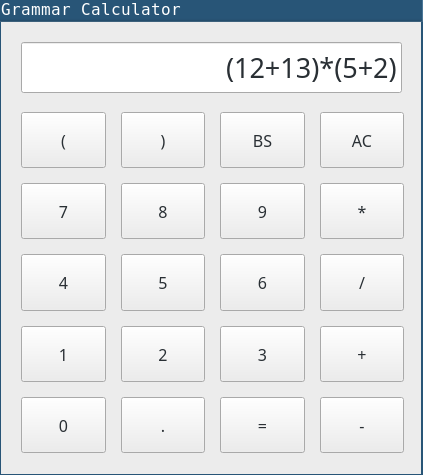

## Grammar Calculator

A simple calculator made in python3.8 with PySide5.14, 
using resursive-descent algorithm to do the calculation.



The code implementation of resursive-descent is similar to EBNF ( extended BNF ),
and here is the grammar in EBNF

```
S → exp $
exp → term { addop term }
term → factor { mulop factor }
factor → (exp) | number
number → digit { digit } [.number]
digit → 0 | 1 | 2 | 3 | 4 | 5 | 6 | 7 | 8 | 9
addop → + | -
mulop → * | /
```

The GUI is unnecessary because it's just a capsulation of the core grammar parsing
file `grammar.py`, you can just use `grammar.py` and input arithmetic expression
in terminal.

***Note***:
The main.py(GUI) will just exit when you input the wrong expression, I'm lazy to
improve the program. You can fix it yourself (:
